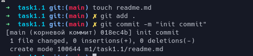
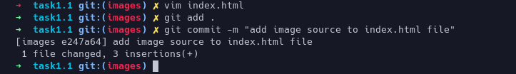
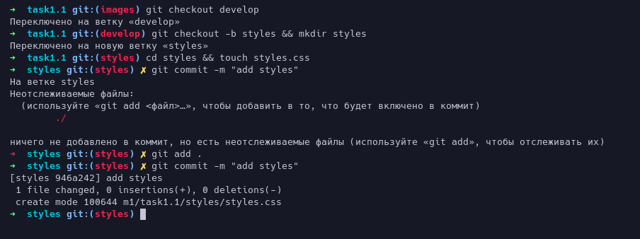
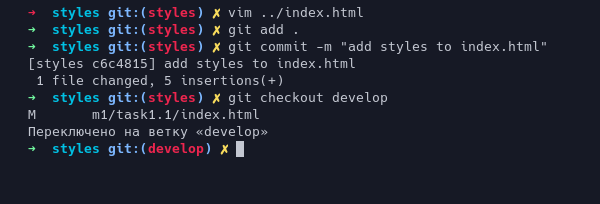
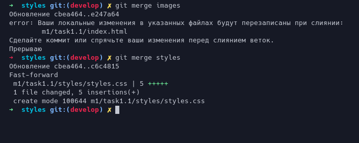
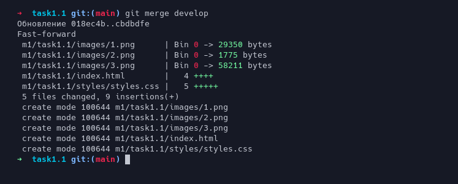
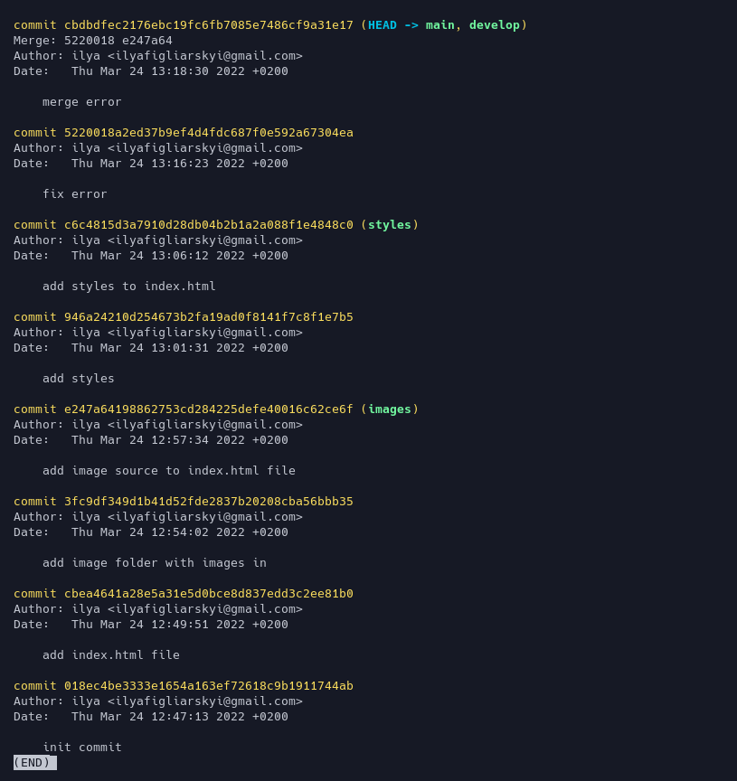
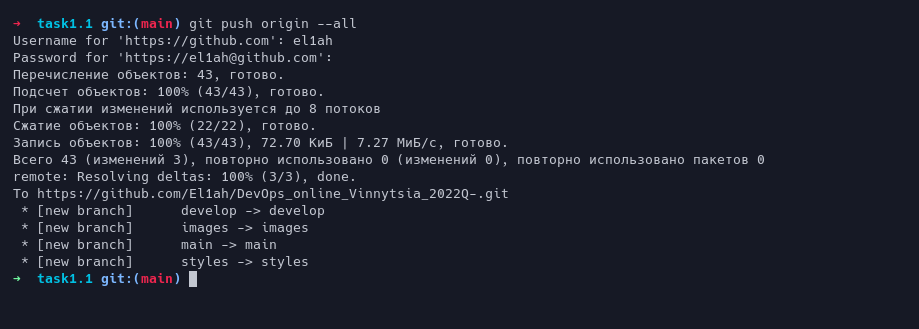

## Making init commit(10-11)

## Creating develop branch(12-13)

## Creating images branch(14)

## Make changes in .html file(15)

## Creating styles branch with .css in it(16-19)

## Trying to merge(20-21)

**Here's conflict**

**How i fix it**

**Seems its working fine**

## Merge develop into master(22)

## Inspecting with git log(23)

!

## Pushing all changes to origin(24)

>In my opinion devops is a combination of development
>and operations practices which contributes to a new practice,
>more improved than other.
>Main benefits of devops is better communication and collaboration,
>faster deployment, and automation.
>All of these can save time and money for the enterprise
