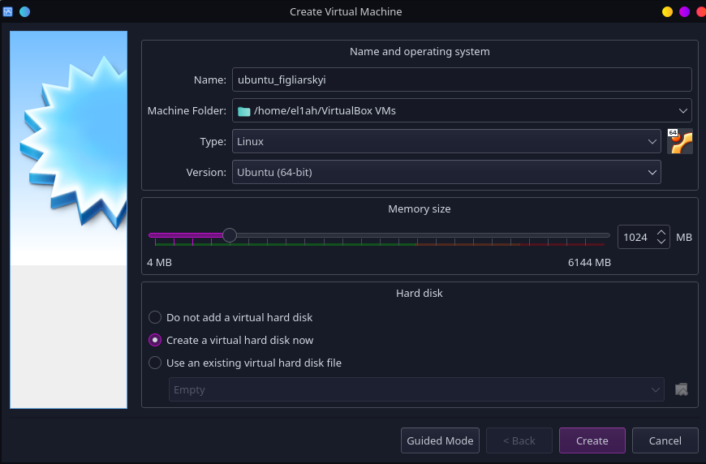
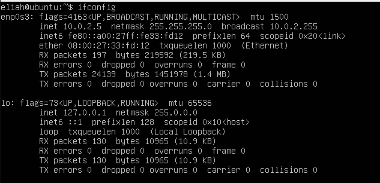

# PART 1. HYPERVISORS

## 1. What are the most popular hypervisors for infrastructure virtualization?

- VMware ESXi

- HyperV

- XenServer

- VirtualBox

- RHEV

## 2. Briefly discribe the main differences of the most popular hypervisors

- Hypervisors have 2 types. First type runs directly on the host machine's physical hardware. Second type is installed on top of an existing OS

# PART 2. WORK WITH VIRTUALBOX

## Creating VM(1.4)

## Creating clone(1.6)

## Creating group and test the functions(1.7)

## Testing snapshot function(1.8)

## Exprot and import ova file(1.9)

## Configure USB connect(2.2)

- virtual machine settings

- Moutned flash-drive(/dev/sdb)
  
  

## Configure shared folder(2.3)

- shared folder settings
  
  
  
  

- mounting folder
  
  

- result
  
  
  
  
  
  

## Configure network settings(2.4)

- Creating NAT-Network
  
  
  
  

- Configure virtual machine
  
  

- Try to ping vm2 from vm1(successful)
  
  
  
  
  
  

- Table of possible connections
  
  

## Working with CLI(3.2)

- List of vm, and info about vm1

- Creating VM

- Start VM

# PART 3. WORK WITH VAGRANT

## Run Vagrant(3-4)

- Init vagrant file and start machine

## Connect to vagrant with Putty(5)

also can use `vagrant ssh` command

## Record the date(6)

## Delete virtual machine(7)

## Making own vagrant box(8)

- Edit vagrant file code

- Run the machine

- Connect to machine

    everythings fine

## Create test enviroment from a few servers(9)

- Make little changes in vagrant file code

- then type `vagrant up` again in terminal

- another server working fine too
