# Main Task

- 1.Create lab topology

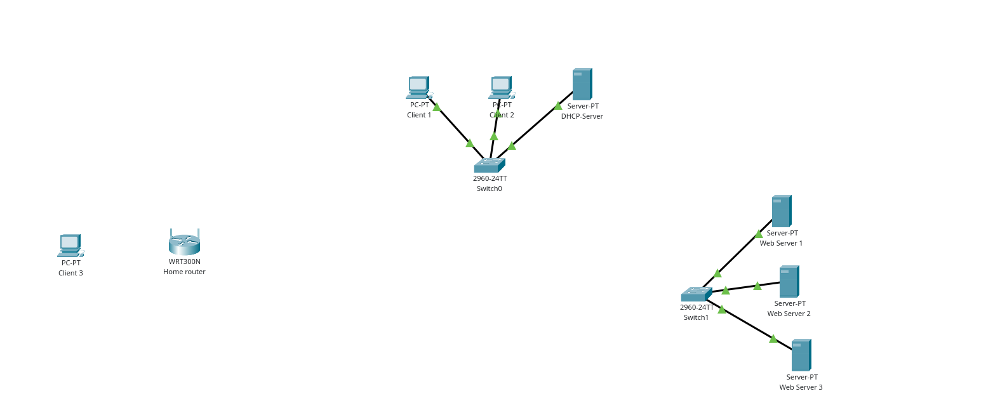

- 2.Configure Enterprise network

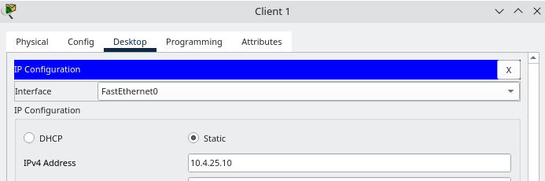

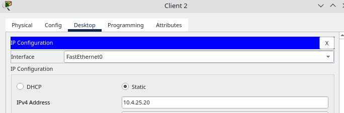

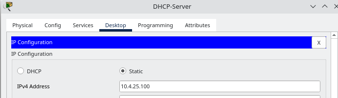

- 3.Test in with `ping`

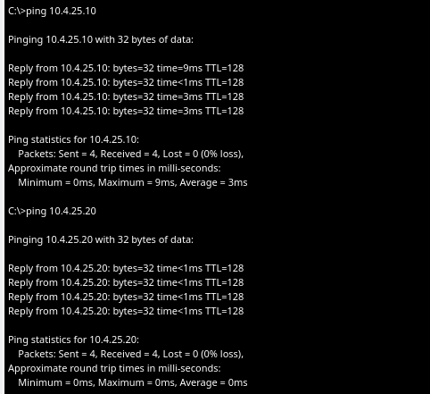

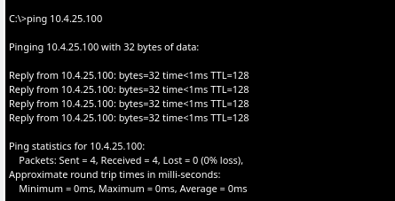

- 4.Configure Data Center network

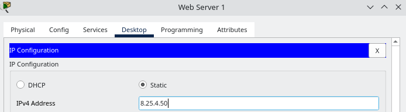

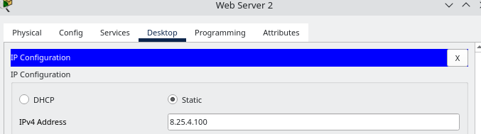

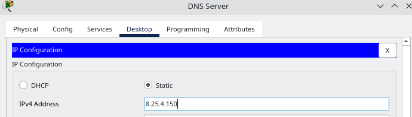

- 5.Test it with `ping`

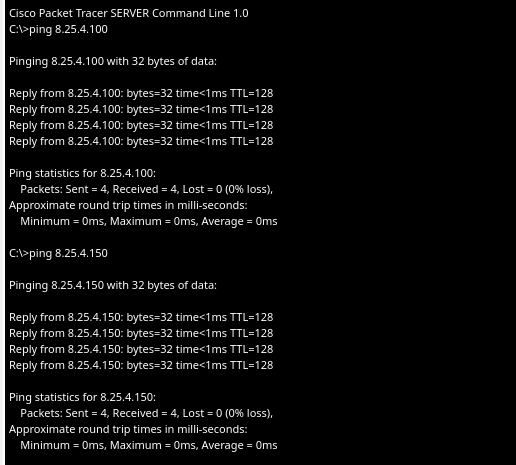

- 6.On the Client3 PC, replace the Ethernet adapter with a Wi-Fi adapter

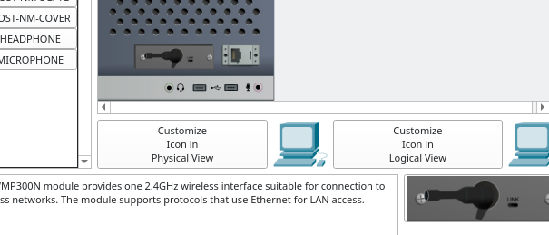

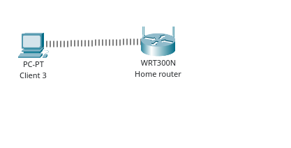

- 7.Configure home network

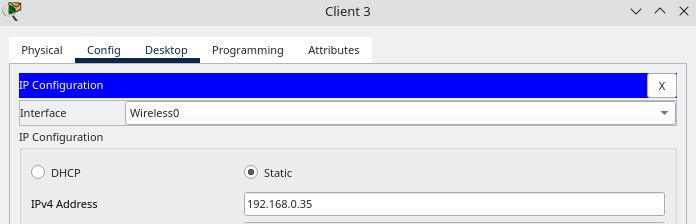

- 8.Test in with `ping`

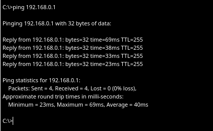

# Additional task

- 1-2. Start wireshark. Choose the interface to capture traffic

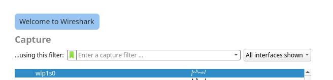

- 3-4. Copy a file through the network. Start analysis

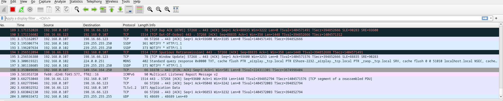

- 5-6. Find a tcp segment. Find channel, network and transport layer headers 

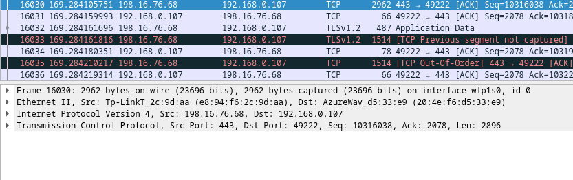

- 7.In each of these headers, find the source and destination MAC addresses, the source and destination IP addresses, and the source and destinatoin port.

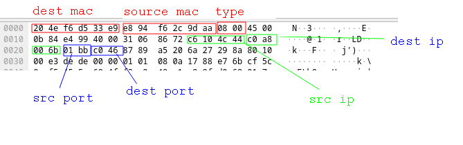
